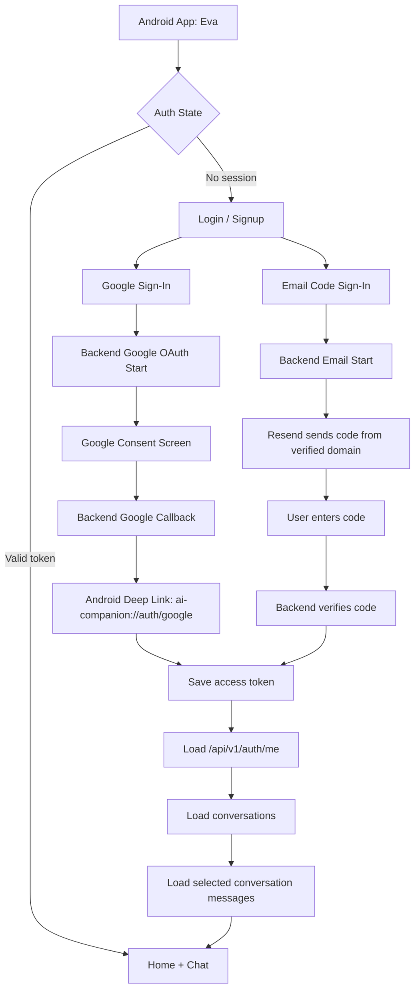
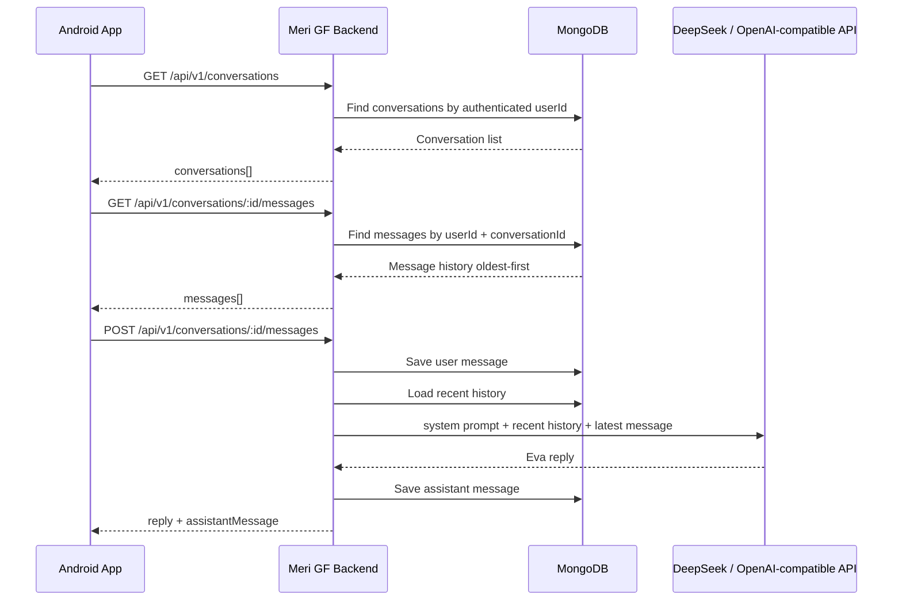
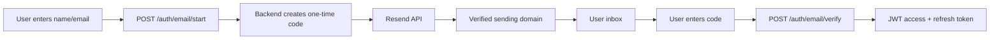
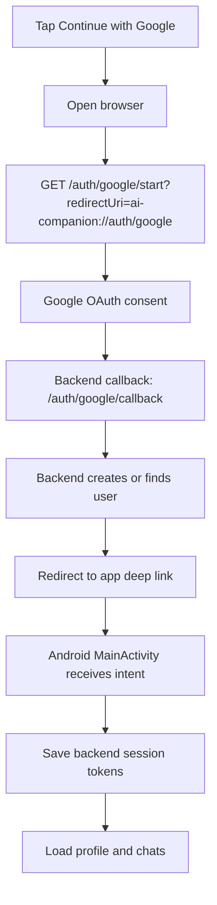
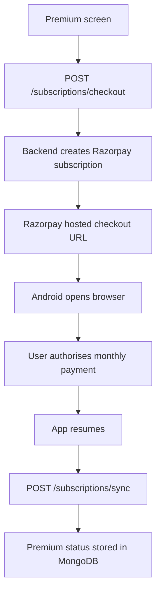

# Eva AI Companion Android App

Eva is the Android client for the Meri GF / AI Companion experience. It is built with Kotlin, Jetpack Compose, and a production backend at `https://api.merigf.com/api/v1`.

The app supports Google sign-in, email confirmation code sign-in through Resend, MongoDB-backed chat history, and backend-generated AI replies through an OpenAI-compatible provider such as DeepSeek.

## App Demo

Watch the app working here: [Eva AI Companion demo video](https://drive.google.com/file/d/1auxOkDGjLEPMesAlrH9TJuLLFtqGP_8v/view?usp=drivesdk)

## Current App

- Native Android app built with Jetpack Compose and Material 3.
- Dark Eva-style companion UI with home, chat, memories, premium, call, and profile screens.
- Google OAuth browser sign-in with Android deep link return.
- Email login/signup with one-time confirmation codes.
- Chat history loaded from MongoDB through the backend.
- Message send flow connected to backend conversations and assistant replies.
- Premium subscription flow connected to backend-created Razorpay checkout.
- Local fallback replies when backend AI is unavailable.
- Keyboard-safe chat composer and auth form fields.
- Eva model image used as the app launcher icon.

## Repository Layout

```text
.
|-- app/
|   |-- src/main/AndroidManifest.xml
|   |-- src/main/java/com/innovatixhub/ai_companion/MainActivity.kt
|   |-- src/main/res/drawable-nodpi/model_riya.png
|   |-- src/main/res/mipmap-*/ic_launcher.png
|   |-- src/main/res/values/strings.xml
|   `-- build.gradle.kts
|-- gradle/
|-- build.gradle.kts
|-- settings.gradle.kts
`-- README.md
```

## Architecture

The app currently uses a compact Compose state-controller architecture. It is close to MVVM in responsibility split, but kept in one Kotlin entry file for speed of iteration.

```text
Compose Screens
  AuthScreen, HomeScreen, ChatScreen, MemoriesScreen, ProfileScreen
        |
        v
EvaAppController
  Holds UI state, auth state, selected tab, conversations, messages, loading flags
        |
        v
MeriGfApi
  HTTP client for auth, profile, conversations, messages
        |
        v
Meri GF Backend
  Fastify + MongoDB + Resend + Google OAuth + DeepSeek/OpenAI-compatible chat
```

Recommended future split:

```text
ui/screens/*        Compose screens
ui/components/*     Shared UI widgets
viewmodel/*         AuthViewModel, ChatViewModel, ProfileViewModel
data/api/*          MeriGfApi
data/models/*       User, Message, Conversation DTOs
data/repository/*   AuthRepository, ChatRepository
```

## End-to-End Flow



## Chat Flow



## Email Confirmation With Resend



Resend is handled fully by the backend. The Android app never stores the Resend API key.

## Google Sign-In Flow



Android deep link:

```text
ai-companion://auth/google
```

Backend callback configured in Google Cloud:

```text
https://api.merigf.com/api/v1/auth/google/callback
```

## Backend Integration

The Android app reads the backend base URL from:

```xml
app/src/main/res/values/strings.xml
```

Current value:

```text
https://api.merigf.com/api/v1
```

Main backend endpoints used by the app:

```text
POST /auth/email/start
POST /auth/email/verify
GET  /auth/google/start
POST /auth/google/mobile/exchange
GET  /auth/me

GET  /subscriptions/me
POST /subscriptions/checkout
POST /subscriptions/sync

GET  /conversations
POST /conversations
GET  /conversations/:conversationId/messages
POST /conversations/:conversationId/messages
```

## Subscription Flow



Current Razorpay plan:

```text
plan_TRv3HKpujDyFoS
Eva Premium Monthly
INR 299/month
```

## DeepSeek Configuration

DeepSeek is configured on the backend, not inside the Android app. The app only calls the Meri GF backend.

Recommended backend env values:

```env
AI_PROVIDER=deepseek
AI_API_BASE_URL=https://api.deepseek.com
AI_API_KEY=your_deepseek_key
AI_MODEL=deepseek-v4-flash
```

For stronger reasoning:

```env
AI_MODEL=deepseek-v4-pro
```

Do not put DeepSeek keys in the Android app.

## Build

Use the Android Studio JBR on Windows:

```powershell
$env:JAVA_HOME='C:\Program Files\Android\Android Studio\jbr'
.\gradlew.bat assembleDebug
```

Generated debug APK:

```text
app/build/outputs/apk/debug/app-debug.apk
```

## Important Android Details

- Package name: `com.innovatixhub.ai_companion`
- App label: `Eva`
- Launcher icon: generated from `model_riya.png`
- Google auth return is handled by `singleTask` `MainActivity`.
- Keyboard behavior uses `adjustResize`, `imePadding()`, and focused-field bring-into-view behavior.
- Session tokens are stored in Android shared preferences under `meri_gf_session`.

## Security Notes

- No Google client secret, Resend key, MongoDB URI, or DeepSeek key should be stored in the Android app.
- The Android app stores only backend-issued access/refresh tokens.
- All third-party provider secrets belong in the backend deployment environment.
- The backend owns Google OAuth verification, Resend email delivery, MongoDB persistence, and DeepSeek requests.
